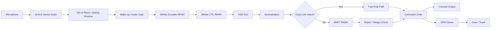

# RK3568 WeNet + BERT Offline Voice Command System

<p align="center">
  <strong>面向 RK3568 的全离线端侧智能语音车控系统</strong><br>
  Microphone → WeNet ASR → Text Normalization → Rule/BERT NLU → Reject Check → Command / GPIO
</p>

<p align="center">
  
  
  
  
  
</p>

## 项目亮点 / Project Highlights

- **完整端侧链路**：从 16 kHz 双声道麦克风采集，到 WeNet ASR、文本归一化、规则/BERT 意图识别，再到命令码输出与 GPIO 硬件控制。
- **RK3568 NPU 部署**：主部署路径中的 WeNet Encoder、CTC 与 BERT 均通过 RKNNLite 在 RK3568 NPU 上执行。
- **双路意图决策**：标准指令优先走 exact-match fast path，复杂语义再进入 BERT，避免所有请求都经过慢路径。
- **误触发控制**：BERT 路径包含拒识类别与 confidence margin 检查，对闲聊和低置信度结果进行拦截。
- **面向真实硬件场景**：GPIO 版本包含 wake/sleep、pre-roll、静音回睡，以及车门/后备箱控制逻辑。

## Recruiter Snapshot

| 项目维度 | 实现内容 |
| --- | --- |
| 目标平台 | Rockchip RK3568 |
| ASR | WeNet Encoder + CTC，RKNNLite/NPU |
| NLU | Rule fast path + BERT RKNN fallback |
| 音频输入 | 16 kHz、16-bit、双声道采集后混合为 mono |
| 实时策略 | 2.5 s 滑动窗口、0.5 s 处理步长、基础音量门控 |
| 稳定性策略 | 拒识类别、margin threshold、wake/sleep、pre-roll |
| 硬件控制 | Linux sysfs GPIO，控制四车门与后备箱 |
| 模型分发 | Git 不跟踪模型二进制，运行模型通过 GitHub Release 提供 |

## System Architecture



## Engineering Challenges & Solutions

| 工程问题 | 处理方式 |
| --- | --- |
| 标准指令无需每次都进入 BERT | 使用 `STRICT_COMMANDS` + 哈希 exact-match fast path，未命中再进入 BERT |
| BERT 误识别可能导致误触发 | 使用拒识类别，并在 BERT 路径加入 margin threshold 检查 |
| 唤醒时容易丢失语音开头 | GPIO 版本使用 pre-roll 环形缓冲区保存唤醒前音频 |
| 长时间无有效语音需要降低持续工作状态 | GPIO 版本根据静音时长自动回到 sleep 状态 |
| 端侧模型需要与 RK3568 NPU 运行环境匹配 | WeNet Encoder、CTC 和 BERT 使用 RKNNLite runtime 加载 RKNN 模型 |
| 语义结果需要映射到真实硬件动作 | 将意图映射为 CAN-style command code，并在硬件版本中进一步映射到 GPIO |

## Core Applications

### `bert_wenet_2rknn.py`

主部署程序，完成：

- 双声道麦克风采集与 mono 混合；
- WeNet RKNN ASR；
- 文本归一化；
- exact-match fast path；
- BERT RKNN 意图分类；
- 拒识与低置信度拦截；
- CAN-style command code 输出。

### `bert_wenet_2rknn_gpio.py`

硬件演示程序，在主链路基础上进一步加入：

- wake/sleep 状态；
- 能量唤醒；
- pre-roll 防吞字；
- 静音回睡；
- Linux sysfs GPIO；
- 四车门与后备箱控制。

## Quick Start

### 1. Clone

```bash
git clone https://github.com/guouguo/bert-wenet-car-command.git
cd bert-wenet-car-command
```

### 2. 下载运行模型

运行所需的 4 个 RKNN 模型通过 GitHub Release 提供：

[Download RK3568 Runtime Models](https://github.com/guouguo/bert-wenet-car-command/releases/tag/v1.0-models)

下载后放入：

```text
models/
├── bert_6L6H_nq.rknn
├── bert_6L6H_nq_gpio.rknn
├── distill2_encoder_T256_quan_mmsehybird099.rknn
└── distill2_ctc_T256.rknn
```

### 3. 安装普通 Python 依赖

```bash
pip install -r requirements.txt
```

> RKNNLite runtime 需要根据 RK3568 目标系统单独安装 Rockchip 对应运行环境，本项目不将 `rknnlite` 作为普通 PyPI 依赖声明。

### 4. 运行

滑动窗口版本：

```bash
python3 bert_wenet_2rknn.py
```

GPIO 硬件版本：

```bash
python3 bert_wenet_2rknn_gpio.py --mic_device 0 --wake_enable 1 --start_asleep 1
```

## Repository Structure

```text
.
├── bert_wenet_2rknn.py                  # 主部署程序
├── bert_wenet_2rknn_gpio.py             # GPIO / wake-sleep 硬件演示
├── bert_door_command_model_pinyin/      # BERT tokenizer/config
├── units.txt                            # WeNet token units
├── models/                              # 本地运行模型目录（模型二进制不进入 Git）
├── tools/                               # RKNN 文件测试工具
├── examples/                            # 历史实现示例
├── assets/audio/                        # 音频资产说明
├── requirements.txt
├── PROJECT_AUDIT.md
└── LICENSE
```

> Note: `examples/bert_wenet_rknn.py` is an archival hybrid CPU/NPU example. Its historical ONNX/RKNN model files are not included in this repository.

## Runtime Models

| 模型 | 用途 | 使用程序 |
| --- | --- | --- |
| `bert_6L6H_nq.rknn` | BERT NLU | `bert_wenet_2rknn.py` |
| `bert_6L6H_nq_gpio.rknn` | BERT NLU | `bert_wenet_2rknn_gpio.py` |
| `distill2_encoder_T256_quan_mmsehybird099.rknn` | WeNet Encoder | 两个主程序共用 |
| `distill2_ctc_T256.rknn` | WeNet CTC | 两个主程序共用 |

两个 BERT 源模型文件原本同名且大小相同，但 SHA256 不同，因此在整理时保留为两个独立运行依赖。

## Hardware Platform

- **SoC**: Rockchip RK3568
- **Audio input**: 16 kHz, 16-bit, stereo microphone input mixed to mono by the application
- **Accelerator**: RKNNLite on RK3568 NPU
- **GPIO interface**: legacy Linux sysfs GPIO (`/sys/class/gpio`)

## GPIO Mapping

| 控制对象 | GPIO | 打开命令码 | 关闭命令码 |
| --- | ---: | ---: | ---: |
| 左前门 | 33 | `0x11` | `0x12` |
| 右前门 | 32 | `0x21` | `0x22` |
| 左后门 | 101 | `0x31` | `0x32` |
| 右后门 | 100 | `0x41` | `0x42` |
| 后备箱 | 99 | `0x51` | `0x52` |

## Design Notes

- 主程序依赖从仓库根目录启动，以保证相对模型路径正确。
- `.rknn`、`.onnx`、`.pt`、`.pth`、`.bin`、`.safetensors` 等模型/权重文件均不进入 Git history。
- 原始真人语音与测试 CSV 未纳入公开仓库。
- GPIO sysfs 接口在部分 Linux 内核中可能不可用，或需要额外权限。
- 模型与 RKNN runtime/driver 的兼容性需要在目标 RK3568 环境中确认。

## Current Scope

当前仓库重点展示 **RK3568 端侧语音链路的工程实现与部署结构**。仓库没有发布未经实际硬件验证的准确率、延迟、RTF、内存、功耗或 NPU 利用率结论。

如果后续补充真实 RK3568 实机测试，可进一步加入：

- 端到端延迟；
- ASR / NLU 实测效果；
- 峰值内存；
- 模型加载时间；
- 实机演示 GIF / 视频。

## License

项目整理代码与文档采用 MIT License，详见 [`LICENSE`](LICENSE)。Third-party frameworks and runtime components remain subject to their respective licenses.
