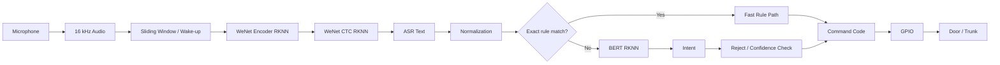

# RK3568 WeNet + BERT Offline Voice Command System

## 项目简介

本项目是运行于 RK3568 的离线端侧智能语音车控系统。系统从双声道麦克风采集 16 kHz 音频，使用 WeNet RKNN 完成 ASR，并通过规则快速路径或 BERT RKNN 完成意图分类，最后输出 CAN-style command code；硬件演示版本进一步通过 Linux GPIO sysfs 控制车门与后备箱。

## 核心功能

- 全离线 WeNet ASR 与 BERT NLU，主部署路径均使用 RKNN/NPU。
- 2.5 秒滑动窗口、0.5 秒处理步长和基础音量门控。
- 标准指令 exact-match fast path，以及 BERT 拒识与置信度 margin 检查。
- GPIO 版本支持 wake/sleep、pre-roll、静音回睡和车门/后备箱控制。
- 保留一个早期 WeNet RKNN + BERT ONNX Runtime 混合实现，用于展示项目演进。

## System Architecture



## 项目目录

```text
.
├── bert_wenet_2rknn.py
├── bert_wenet_2rknn_gpio.py
├── bert_door_command_model_pinyin/
├── units.txt
├── models/
├── tools/
├── examples/
└── assets/audio/
```

`examples/` contains an earlier hybrid CPU/NPU implementation. The primary deployment uses RKNN for both WeNet and BERT.

## Hardware Platform

- SoC: Rockchip RK3568
- Audio input: 16 kHz, 16-bit, stereo microphone input mixed to mono by the application
- Accelerator: RKNNLite on the RK3568 NPU
- GPIO interface: legacy Linux sysfs GPIO (`/sys/class/gpio`)

## RK3568 Deployment

1. 在 RK3568 上准备与目标系统匹配的 Python、音频驱动和 Rockchip RKNN runtime 环境。
2. 安装 `requirements.txt` 中的普通 Python 依赖。
3. 将运行模型放入 `models/`，文件名须与下节一致。
4. 从项目根目录启动程序，以保证相对路径正确。

RKNNLite runtime must be installed using the Rockchip RKNN runtime environment appropriate for the RK3568 target. 本项目不将 `rknnlite` 作为普通 PyPI 依赖声明。

## Model Files

Git 不跟踪 RKNN/ONNX 等大型模型。两个同名 BERT 源文件大小相同但 SHA256 不同，因此审计中未将它们合并；GPIO 版本在整理副本中使用独立文件名。

```text
models/
├── bert_6L6H_nq.rknn
├── bert_6L6H_nq_gpio.rknn
├── distill2_encoder_T256_quan_mmsehybird099.rknn
└── distill2_ctc_T256.rknn
```

运行所需的 RKNN 模型通过 GitHub Release 提供：

https://github.com/guouguo/bert-wenet-car-command/releases/tag/v1.0-models

下载后请将 4 个 `.rknn` 文件放入项目根目录下的 `models/` 目录。

## Dependencies

普通 Python 依赖见 `requirements.txt`。此外需要：

- 与 RK3568 系统匹配的 Rockchip RKNNLite runtime；
- 可用的 PortAudio/PyAudio 音频环境；
- GPIO 演示所需的 sysfs GPIO 权限与对应内核支持。

## Usage

滑动窗口演示：

```bash
python3 bert_wenet_2rknn.py
```

GPIO 硬件演示（默认上电休眠）：

```bash
python3 bert_wenet_2rknn_gpio.py --mic_device 0 --wake_enable 1 --start_asleep 1
```

运行前请自行核对麦克风设备号、GPIO 编号、模型兼容性和硬件安全条件。本次整理仅执行静态检查，未初始化 RKNN、未采集音频、未操作 GPIO。

## GPIO Mapping

| 控制对象 | GPIO | 打开命令码 | 关闭命令码 |
| --- | ---: | ---: | ---: |
| 左前门 | 33 | `0x11` | `0x12` |
| 右前门 | 32 | `0x21` | `0x22` |
| 左后门 | 101 | `0x31` | `0x32` |
| 右后门 | 100 | `0x41` | `0x42` |
| 后备箱 | 99 | `0x51` | `0x52` |

## Limitations

- 相对路径要求从仓库根目录启动。
- GPIO sysfs 接口可能在部分 Linux 内核中不可用或需要额外权限。
- 模型与 RKNN runtime/driver 的兼容性需在实际 RK3568 设备上人工验证。
- 仓库不包含原始真人录音，也不提供准确率、延迟、RTF、内存、功耗或 NPU 利用率结论。

## License

项目整理代码与文档采用 MIT License，详见 `LICENSE`。Third-party frameworks and runtime components remain subject to their respective licenses.
